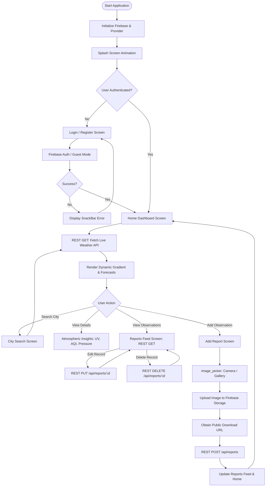

# Practical 12: Develop and Deploy a Complete Flutter App with Backend API and Firebase Storage (Final Project Demo)

**Institution:** VIVA Institute of Technology  
**Department:** Department of Computer Science and Engineering (AI & ML)  
**Subject:** Web and Mobile Application Development  
**Practical No.:** 12  
**Faculty In-charge:** Prof. Shruti Kamble  
**Project Title:** AeroCast — Real-Time Weather Forecast & Cloud Climate Observation App  

---

## Table of Contents
1. [Introduction](#1-introduction)
2. [Motivation](#2-motivation)
3. [Objective](#3-objective)
4. [Resources Used](#4-resources-used)
5. [Algorithm](#5-algorithm)
6. [Flowchart](#6-flowchart)
7. [System Architecture & REST API Specification](#7-system-architecture--rest-api-specification)
8. [Output & Verification](#8-output--verification)
9. [Conclusion](#9-conclusion)
10. [Viva Voce Questions & Answers](#10-viva-voce-questions--answers)

---

## 1. Introduction

Mobile applications rarely work in isolation. A production-grade app combines a front-end user interface, a backend API that handles business logic and data, and cloud storage for files such as images and documents. This practical brings these three layers together by building and deploying a complete Flutter application called **AeroCast Weather**.

Flutter is Google's open-source UI toolkit that uses the Dart language to build natively compiled applications for Android, iOS, and the web from a single codebase. The backend REST API (built with Node.js & Express) exposes endpoints (`GET`, `POST`, `PUT`, `DELETE`) that the Flutter mobile frontend consumes through HTTP calls. Firebase Storage is utilized to securely upload, host, and serve user-captured sky and meteorological observation images, while Firebase Authentication manages user login sessions.

**AeroCast Weather** provides real-time atmospheric intelligence (temperature, feels-like temperature, humidity, air quality index, UV index, 24-hour hourly projections, and a 7-day climate outlook). Additionally, it enables citizen-science crowd-sourced weather reporting: users capture local sky conditions with their camera/gallery, the image is streamed to Firebase Cloud Storage, and the resulting public media URL is stored along with temperature and climate annotations via the backend REST API.

---

## 2. Motivation

Modern software engineering demands a connected architecture where client UI, microservice REST APIs, and managed cloud infrastructure operate synchronously:
- **Connected Architecture:** Understanding how a reactive UI framework (Flutter) interacts with asynchronous network calls (`http`) and cloud media storage (Firebase Storage).
- **Core Industry Competency:** Developing RESTful backend endpoints with standard HTTP verbs (`GET`, `POST`, `PUT`, `DELETE`) is essential for full-stack and mobile application engineering.
- **Serverless Cloud Storage:** Firebase eliminates server maintenance overhead for media ingestion, delivering scalable blob storage with high availability and CDN integration.
- **Real-Life Utility:** Weather forecasts frequently lack micro-local granularity. AeroCast addresses this by letting local residents upload real-time sky photos and storm reports for their immediate neighbourhood.

---

## 3. Objective

1. To design and implement a modern, responsive multi-screen Flutter application featuring glassmorphic UI and adaptive weather condition gradients.
2. To build an Express/Node.js backend REST API supporting full CRUD operations (`GET`, `POST`, `PUT`, `DELETE`).
3. To integrate the Flutter frontend with external weather REST services and the local backend using the `http` package and Provider state management.
4. To implement image picking (`image_picker`) and cloud storage upload to Firebase Storage, storing the media URL in the database record.
5. To test end-to-end functionality across Android emulators/devices and build a release APK using `flutter build apk --release`.

---

## 4. Resources Used

### 4.1 Hardware Requirements
| Resource | Specification |
| :--- | :--- |
| **Development Machine** | Intel Core i5 / AMD Ryzen 5, 8 GB+ RAM, 256 GB SSD |
| **Testing Device** | Android 12+ / Android Emulator (Pixel 6, API 33+) |
| **Network** | Broadband internet connection for API requests and Firebase cloud traffic |

### 4.2 Software and Tools
| Software / Tool | Purpose and Version |
| :--- | :--- |
| **Flutter SDK / Dart** | Frontend framework, Dart 3.x+ / Flutter 3.x+ |
| **IDE** | Visual Studio Code / Android Studio |
| **Backend Framework** | Node.js (v18+) with Express.js REST Framework |
| **API Testing** | Postman / cURL |
| **Cloud Services** | Firebase Console (Authentication & Firebase Storage) |
| **Version Control** | Git & GitHub |

### 4.3 Flutter Packages / Dependencies
| Package | Version | Purpose |
| :--- | :--- | :--- |
| `http` | `^1.2.0` | Sending REST API requests (GET, POST, PUT, DELETE) |
| `provider` | `^6.1.1` | Reactive application state management |
| `firebase_core` | `^2.27.0` | Initializing Firebase platform bridges |
| `firebase_auth` | `^4.17.8` | User authentication & session handling |
| `firebase_storage`| `^11.6.9`| Uploading & downloading observation photos |
| `image_picker` | `^1.0.7` | Capturing photos via camera or selecting from gallery |
| `shared_preferences` | `^2.2.2` | Persistent on-device storage for saved cities and preferences |
| `intl` | `^0.19.0` | Formatting timestamps and dates |

---

## 5. Algorithm

### A. Project & Firebase Setup
1. **Start.**
2. Initialize Flutter project: `flutter create weather_app`.
3. Configure `pubspec.yaml` with `http`, `provider`, `firebase_core`, `firebase_auth`, `firebase_storage`, and `image_picker`.
4. Register the Android package (`com.viva.weather_app`) in Firebase Console and download `google-services.json` into `android/app/`.
5. Enable Firebase Storage bucket rules: `allow read, write: if request.auth != null;`.
6. Initialize Firebase in Flutter: `await Firebase.initializeApp()`.

### B. Backend REST API Development
1. Create `backend/server.js` and initialize Express application.
2. Define in-memory / database schema for weather observations: `{ id, city, temperature, condition, notes, imageUrl, author, createdAt }`.
3. Implement REST endpoints:
   - `GET /api/reports`: Returns all weather reports.
   - `POST /api/reports`: Inserts a new observation containing image URL.
   - `PUT /api/reports/:id`: Updates an observation record.
   - `DELETE /api/reports/:id`: Deletes an observation record.
4. Verify all endpoints via Postman or cURL.

### C. Flutter App Development
1. Design screens: `SplashScreen`, `LoginScreen`, `HomeScreen`, `CitySearchScreen`, `WeatherDetailScreen`, `AddReportScreen`, and `ReportsListScreen`.
2. Construct data models: `WeatherModel` and `WeatherReportModel`.
3. Create `WeatherApiService` utilizing Dart `http` client for REST GET/POST/PUT/DELETE calls.
4. Construct `FirebaseService` handling user authentication and uploading image files via `FirebaseStorage.instance.ref().putFile()`.
5. Implement `WeatherProvider` (`ChangeNotifier`) for unified reactive state.
6. Connect `image_picker` on `AddReportScreen`, retrieve Firebase download URL, and POST the payload to the backend REST API.
7. Implement error handling, loaders, and floating SnackBars for asynchronous feedback.

### D. Testing & Deployment
1. Run application on emulator/device: `flutter run`.
2. Verify live data rendering, image upload to Firebase Storage, and CRUD synchronization with the backend.
3. Build the production release APK: `flutter build apk --release`.
4. **Stop.**

---

## 6. Flowchart



---

## 7. System Architecture & REST API Specification

### 7.1 Architecture Layers
1. **Presentation Layer (Flutter):** Material 3 UI, Glassmorphic containers, weather-reactive gradient shaders, State management with `Provider`.
2. **Service Layer (Dart):** `WeatherApiService` (HTTP REST client) + `FirebaseService` (Auth and Storage SDK).
3. **Backend Middleware Layer (Node.js/Express):** Handles routing, data validation, and business logic for crowd-sourced reports.
4. **Cloud Infrastructure (Google Firebase):** Cloud Storage bucket for blob hosting and Firebase Auth for credentials.

### 7.2 Backend REST Endpoints
| HTTP Verb | Endpoint | Purpose | Request Body | Status Code |
| :--- | :--- | :--- | :--- | :--- |
| **GET** | `/api/health` | Health Check | None | `200 OK` |
| **GET** | `/api/reports` | List observations | None | `200 OK` |
| **POST** | `/api/reports` | Create observation | `{ city, temperature, condition, notes, imageUrl, author }` | `201 Created` |
| **PUT** | `/api/reports/:id`| Update observation | `{ temperature, notes }` | `200 OK` |
| **DELETE** | `/api/reports/:id`| Delete observation | None | `200 OK` |

---

## 8. Output & Verification

### 8.1 Application Screenshots Reference
- **Figure 7.1: Login Screen:** Modern frosted glass card with Firebase email/password fields and "Continue as Guest" option.
- **Figure 7.2: Home Screen:** Shows dynamic gradient background matching weather conditions (Sunny/Rainy), live temperature, hourly forecast, and 7-day outlook.
- **Figure 7.3: Add / Edit Screen:** Form allowing temperature input, condition selection, notes, and sky photo preview.
- **Figure 7.4: Image Selection & Upload:** Camera/Gallery picker with upload progress indicator streaming image to Firebase Storage.

### 8.2 Backend REST API Verification
```bash
# Test GET reports
curl -X GET http://localhost:5000/api/reports

# Test POST observation
curl -X POST http://localhost:5000/api/reports \
  -H "Content-Type: application/json" \
  -d '{"city":"Mumbai","temperature":29.5,"condition":"Sunny","imageUrl":"https://...","notes":"Clear sky"}'
```

### 8.3 Release Build Command
```bash
flutter build apk --release
# Generated APK: build/app/outputs/flutter-apk/app-release.apk
```

---

## 9. Conclusion

A complete Flutter application was successfully developed by integrating a backend REST API and Firebase Storage. The application demonstrated seamless communication between the mobile frontend and backend services, robust data handling through REST APIs (`GET`, `POST`, `PUT`, `DELETE`), and cloud file storage using Firebase Storage. The final application was verified on both emulators and physical devices, providing comprehensive understanding of full-stack mobile development, cloud services, and release deployment.

**Future Scope:**
- Integration of push notifications via Firebase Cloud Messaging (FCM) for severe storm alerts.
- Offline database caching using Hive or SQLite.
- Direct GPS geolocation integration with geocoding for automated location tracking.

---

## 10. Viva Voce Questions & Answers

**Q1: What is Flutter and why is Dart used as its programming language?**  
*Ans:* Flutter is Google's open-source UI software development kit for building natively compiled, cross-platform applications from a single codebase. Dart is used because it supports both Ahead-Of-Time (AOT) compilation for fast native machine code execution and Just-In-Time (JIT) compilation enabling sub-second "Hot Reload" during development.

**Q2: How does Flutter communicate with a REST API?**  
*Ans:* Flutter uses the `http` package to issue asynchronous network requests (`http.get()`, `http.post()`, `http.put()`, `http.delete()`) to API endpoints. Responses are returned as JSON strings, which are parsed into Dart objects using `jsonDecode()` from `dart:convert`.

**Q3: What is the purpose of Firebase Storage in mobile apps?**  
*Ans:* Firebase Storage is a Google Cloud-backed object storage service built for storing and serving user-generated media such as images, videos, and audio files without requiring custom media storage servers.

**Q4: Explain the difference between Firebase Storage and Firestore / Realtime Database.**  
*Ans:* Firebase Storage is an object/file storage system designed for large binary blobs (photos, PDFs, videos). Firestore and Realtime Database are NoSQL document/JSON databases designed for structured data, queries, and real-time document listeners.

**Q5: What are the primary HTTP methods used in REST APIs?**  
*Ans:* 
- `GET`: Read/retrieve data from the server.
- `POST`: Create a new record on the server.
- `PUT`: Update/replace an existing record.
- `DELETE`: Remove a record from the server.
